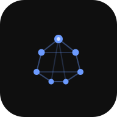

<div align="center">
  

  # Second Brain

  **Everything on your mind. One calm place to put it.**

  A private, self-hosted home for tasks, projects, notes, lists, and habits.
</div>

---

Second Brain is made for the quiet work of keeping your life together.

Capture something before it disappears. Turn it into a task when it matters.
Give larger plans a little structure. Keep the groceries separate from the
ideas, and the habits visible without letting any of it take over your day.

No feeds. No team dashboards. No productivity theatre. Just your things, in a
place that feels considered.

## One Place, Six Clear Spaces

**Tasks** for what needs doing. Add one in a moment, give it a date when it
needs one, and let completed work move quietly out of the way.

**Projects** for the things that take more than one step. Add stages, see real
progress, and keep the notes behind a project close to the work itself.

**Groceries** and **Buys** for the lists you come back to. Familiar items are
remembered, so recurring errands stay effortless instead of becoming clutter.

**Notes** for thoughts that need somewhere to land. They save as you write and
stay simple enough that writing remains the point.

**Habits** for the rhythms you want to keep. Track a daily practice or work
toward a weekly, monthly, or yearly target without turning your life into a
spreadsheet.

## Designed to Get Out of the Way

Second Brain feels at home on both a desktop and a phone. The desktop gives
your work room to breathe, with focused collections and details alongside the
list. Mobile keeps the same structure close at hand with fast entry,
touch-friendly controls, and compact navigation.

Every interaction is intentionally small. Press Return to capture. Select to
edit. Check something off and keep moving.

Light and dark appearances follow your device. Install it to your Home Screen
and it opens like an app, without giving up ownership of your data.

## A Gentle Look Ahead

Today is the home view. It brings due tasks, habits, transparent suggestions
from unscheduled work, and the next seven days into one calm, actionable place.
Task lists remain available as one continuous, quickly scannable page on mobile.

Due dates highlight what needs attention without making everything feel urgent.
Optional reminders bring back tasks due today and habits still waiting for a
check-in.

The “What next” section offers a few unscheduled tasks with a plain explanation
of where each came from. One tap can bring a suggestion into Today, complete it,
or open its details.

## Yours, Properly

Second Brain runs on your server and stores everything in your own SQLite
database. There are no accounts to create, no subscription, no analytics, and
no service holding your notes on your behalf.

It is intentionally small: one Go application, one database, one person.

## Version 4

Version 4 is a new chapter for Second Brain. It brings a focused desktop
workspace, a new Today view, thoughtful mobile navigation, faster capture,
direct editing, stronger notes, richer habits, project details, daily planning,
notifications, and a visual identity that finally feels like the product.

The result is not a system you have to manage. It is simply a dependable place
to return to.

## Make It Yours

Create a `.env` file with your own eight-digit passcode:

```dotenv
PASSCODE=12345678
TZ=Europe/Bucharest
```

Then start Second Brain:

```bash
mkdir -p data
docker compose up -d
```

Open [http://localhost:8080](http://localhost:8080).

For upgrades, backups, and deployment details, see
[the upgrade guide](docs/UPGRADE.md).
